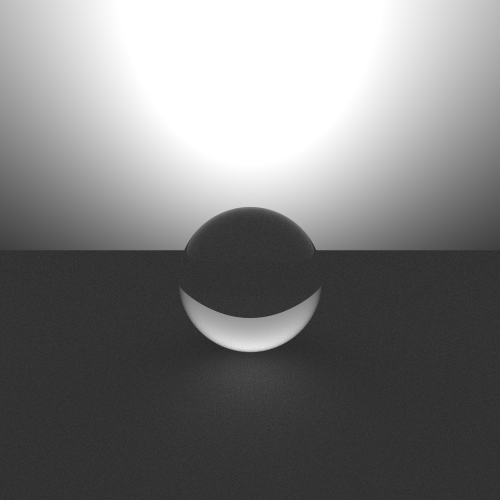

# Raytracer

A WIP toy raytracer for learning.

## Samples
Diffuse material:  

Glass material:  

Multiple importance sampling in a slightly more complicated scene:  

## Features
- A monte-carlo pathtracer
- Diffuse, Specular, Mirror materials
- Sphere, plane, box geometries
- GUI to watch render
- Multithreaded rendering using openMP

## TODO
### Misc. Features
- Import .obj files
- Skybox
- Interactive and movable camera
- Spectral rendering
- alias tables for O(1) sampling

### Bugs
- Specular refractive index fix

### Raycasting improvements
- ~~Implement AABB~~
- BVH acceleration (see PBRT book)
- Optimization for shadow rays (early termination by stopping on any found intersection between 2 points)

### Variance reduction
- ~~Russian roulette~~
  - ~~Brightness based russian roulette~~
- ~~Hemisphere sampling~~
- ~~Multiple importance sampling~~

### CUDA
- Use small kernels over a singular megakernel (see jacco blog)
- Data oriented design (DOD) such that all the attributes of a certain types are arrays
- CUDA SIMD intrinsics for even more speed

### Misc. Optimization
- Test Vec4

## Dependancies
You'll have to install Intel Embree to be able to compile and run this at the moment
